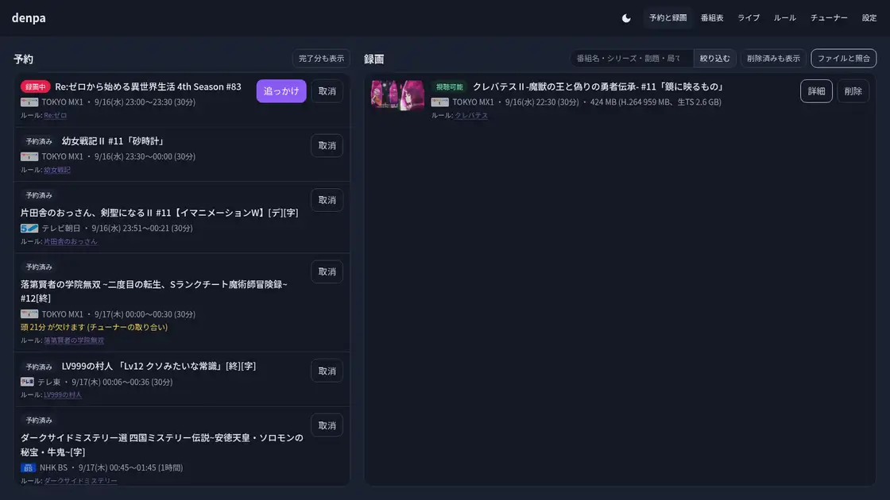
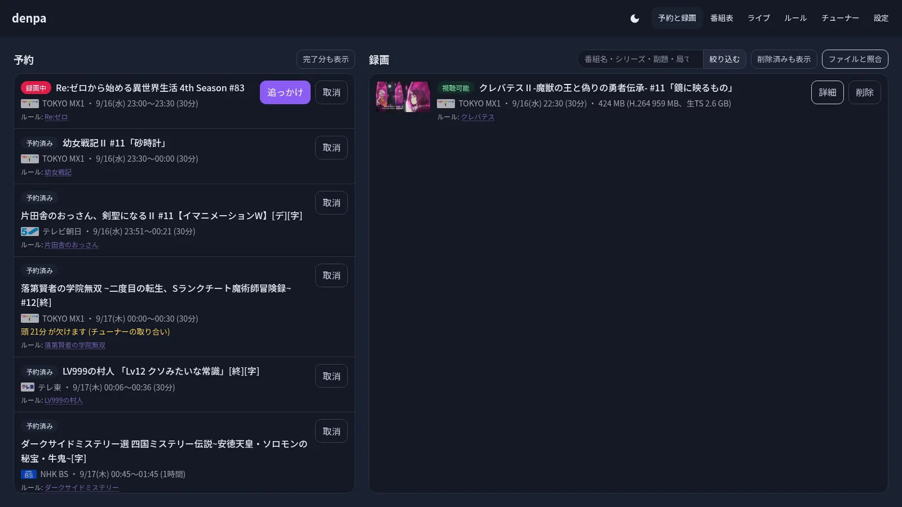
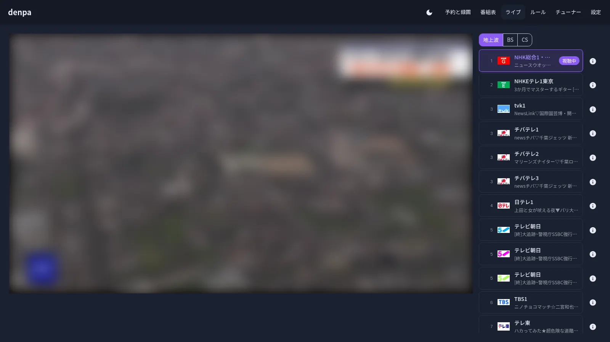
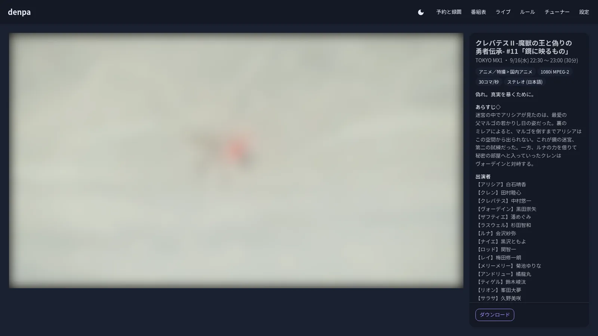

# denpa

**テレビを録って観るための、自分の家に置くサーバ**です。番組表から押すだけで予約し、
録ったものはブラウザでそのまま観るか、テレビの VLC へ飛ばすか、落として好きな
プレイヤーで。放送中のものもブラウザで観られます (字幕・データ放送つき)。
メディアサーバは置きません。

<p align="center">
  
</p>

<table>
  <tr>
    <td align="center"><a href="docs/screens.md#予約と録画"></a><br><sub><b>予約と録画</b> — サムネ付き。押せばその場で観る</sub></td>
    <td align="center"><a href="docs/screens.md#ライブ"></a><br><sub><b>ライブ</b> — 字幕もデータ放送も。止めれば追っかけ</sub></td>
    <td align="center"><a href="docs/screens.md#録画を観る"></a><br><sub><b>観る</b> — 放送どおりの字幕、CMは自動で飛ばす</sub></td>
  </tr>
</table>

**画面の一覧は [docs/screens.md](docs/screens.md)** (実機の絵。番組表・ルール・チューナー・設定も)。

## しくみ

部品は **チューナーエージェント** (選局) と **denpa** (番組表・予約・録画・エンコード・
配信・ライブ視聴) の2つだけです。

```text
チューナー ── エージェント ── denpa ── 録画(mkv) ─┬─→ ブラウザでそのまま観る
                                                    └─→ テレビの VLC へ飛ばす / 落として好きなプレイヤーで
```

エージェントは**チャンネルを掴んで素のTSを流すだけ**で、番組表を読むのも、局を
選り分けるのも、CMを見つけるのも denpa がやります。録画は CM をチャプターにして
AV1 / H.264 の mkv に焼き、字幕は放送のまま絵で入れます。

## できること

予約は番組表から押すだけ、または「ルール」にキーワードを登録して自動で。
録れたものは自分で CM を見つけて焼き、行を押せばそのまま観られます。

### いま流れているものを観る

**「ライブ」を開くと、放送中のものがそのまま観られます。** 前回見ていた局から
開くので、テレビを点けたときと同じです。

- **放送から 1 秒ほどで観られます。** 止めた所からも見られ、追いつくときは速さを
  選べます。**放送との差はその場で出します** — 放送そのものが運んでいる時刻
  (TDT/TOT) と突き合わせたものなので、選局から焼き上がり・回線まで全部入りです
  ([docs/stream.md](docs/stream.md#遅延は2つある))
- **焼き方を選べます。** H.264 は**どの端末でも出る**ほう、AV1 は**軽い**ほう (宅外向け)
- **音声も字幕も放送どおり。** 二カ国語や解説放送も選べ、字幕は絵で出るので
  外字も崩れません
- **データ放送も出ます** (d ボタン)。テレビと同じ BML がそのまま動き、指で押せる
  リモコンが右に並びます。地元の天気にするには設定に郵便番号を
  ([docs/stream.md](docs/stream.md#56-データ放送の統合))

### 録画を観る

**録画一覧の行を押すと、その場で再生が始まります。** 別のアプリは要りません。
番組の中身は右に並んで出ます。

- **どこを押しても再生と一時停止**、左右の端を素早く2回で10秒戻す/送る
- **CM は自動で飛ばします** (既定で入)。**CM のコマは1枚も出しません。** 送りのボタンで手で飛ばすこともできます
- **字幕・倍速 (1〜2倍)・切り抜き** (いまの場面を字幕ごとクリップボードへ)
- **続きから始まります。** 別の端末で開いても続きます。観終わったその場で消せます

**テレビ (Android TV / Fire TV) で観るときは、テレビの VLC に飛ばします。**
VLC のリモートアクセスを有効にしてテレビを設定に登録すると、録画詳細の
「テレビで再生」から**いま開いている端末が**テレビへ直接飛ばします
(初回だけ、証明書を受け入れてテレビに出る6桁コードでペアリング)。
AV1 が再生できないテレビには、テレビごとに H.264 や生TSを渡せます。

**それ以外のプレイヤーには「再生リンクをコピー」で。** 24時間で切れる URL なので、
どのプレイヤーにでも貼れます。字幕は入れ物の中に入っているのでそのまま出ます
([docs/library.md](docs/library.md#手元のプレイヤーで観る))。

## 用意するもの

- **チューナー** — Linux DVB (PT2/PT3、PX-S1UD など)。ドライバはホスト側に入れておく
- **B-CASカード** と PC/SC 対応のリーダー
- **Docker** (Compose) か **Kubernetes** (Helm)
- あれば **Intel の GPU** — `/dev/dri` が見えれば起動時に見つけて GPU で焼きます
  (Helm は既定で渡す。無ければソフトウェア。[docs/encode.md](docs/encode.md)「GPU で焼く」)

## 立てる

**Docker Compose** か **Helm** のどちらか。イメージは公開してあるので、
リポジトリを持ってくる必要はありません。

### Docker Compose

```sh
mkdir denpa && cd denpa
curl -Lo compose.yml https://raw.githubusercontent.com/danything/denpa/main/compose.prod.yml
docker compose up -d
```

### Helm (Kubernetes)

```sh
# 本体 + チューナーエージェント (同じクラスタに置く)
helm install denpa oci://ghcr.io/danything/charts/denpa \
  --namespace denpa --create-namespace \
  --set denpa.trustedNetworks=192.168.0.0/16 \
  --set ingress.enabled=true --set 'ingress.hosts[0]=denpa.example.home'
```

チューナーの刺さった機械にはエージェントだけ置き、本体は別の所 (別ノードや
docker compose) で動かす構成なら `oci://ghcr.io/danything/charts/denpa-agent` を
(本体側は `TUNER_AGENT_URL` でそこを指す)。**値の一覧と意味は
[charts/denpa/values.yaml](charts/denpa/values.yaml)** に全部コメントで書いてあります。

### 立てたあと

1. **開く** — <http://localhost:3000>。誰を通すかは `TRUSTED_NETWORKS` で決めます —
   compose.yml には**家の中 (プライベートネットワーク) だけ通す**初期値が書いてあります
   (Helm は `denpa.trustedNetworks`)。設定を消すと全部のアクセスを断り、全部開けるなら
   `0.0.0.0/0` (下の「誰を通すか」の注意を読むこと)
2. **チューナーを確かめる** — 「チューナー」に、見つかったものが並んでいます。
   本数と種別 (地上波 / 衛星) が合っていれば、そのまま次へ
3. **スキャンする** — 同じ画面から。チャンネルは空で出荷しているので、これをやるまで
   番組表も空です。地上波の総当たりで**十数分**
4. **待つ** — 終われば自分で番組表を集めに行きます (**数分**)
5. **予約する** — 番組表から選ぶか、「ルール」にキーワードを登録して自動で

**設定ファイルを書く必要はありません。** チューナーは自動で見つけて種別まで判別し、
直すところがあっても「チューナー」の画面から書けます。**うまくいかないときも同じ画面**
を見てください — エージェントとカードリーダーの状態、スキャンの結果、番組表の集まり
具合が出ます。**カードリーダーが NG のまま録ると、成功したように見えて中身が
スクランブルされたまま**になります。

イメージは `latest` を指していて、リリースのたびに動きます。**版を固定したいなら `1.1.1` の
ように書けます** ([docs/architecture.md](docs/architecture.md#イメージのタグ))。

## 誰を通すか

**入る道を設定するまで、全部のアクセスを断ります** (理由つきの 403)。
入る道は2つで、どちらか (または両方) を設定します:

- **`TRUSTED_NETWORKS`** — このネットワークから来た人は何も聞かずに通します
  (例 `TRUSTED_NETWORKS=192.168.1.0/24`。テレビの VLC に資格情報を入れずに
  使わせるのもこれ)。**全部のアクセスを許可するなら `TRUSTED_NETWORKS=0.0.0.0/0`**
- **OIDC** — 画面をログインで守ります。`OIDC_ISSUER` など3つ渡すと有効になります

**公開するときの注意:**

- **`0.0.0.0/0` はインターネットに向けて開くのと同じ意味です。** 録画も設定も
  誰でも触れます。家の外に出す構成では使わず、OIDC を設定してください
- **リバースプロキシの後ろに置くなら `ADDRESS_HEADER=x-forwarded-for` を。**
  無いと接続元が全部プロキシの住所になり、`TRUSTED_NETWORKS` が誰にも当たりません
  (プロキシが無ければ何も要りません)。逆に、**プロキシを通さず直接届く経路があると
  このヘッダは詐称できる**ので、denpa へは前段経由でしか届かないことを確かめてから
- 録画の再生・ダウンロードのリンクは期限付きURL (発行から24時間で失効。作り直すと同じURLのまま延びる)
  なので、リンク単体が漏れても恒久の入口にはなりません

いずれも入れ方・理由は [docs/auth.md](docs/auth.md) に。

## 確かめきれていないこと (情報を募っています)

**手元の機材では当てられていないところです。** 動いた/動かなかったを
[Issue](https://github.com/danything/denpa/issues) で教えてもらえると、ここを埋められます。

- **`px4_drv` を chardev (`/dev/px4video*`) で使うチューナーでの選局** (コードは
  ありますが、値は資料から取ったものです)
- **ロゴの在り処の割り出しが、薄いロゴの局でどこまで当たるか。** 実測で詰めたのは
  テレ東1局ぶんで、閾値もそこから決めた値です。**TOKYO MX1 では外しました**
  (背景の窓枠を掴んだ)。外したときは自動検出に戻す作りにしてありますが、
  当たる局と外す局の見分けは付いていません
  ([docs/encode.md](docs/encode.md#外したら無かったことにする))
- **ライブの「放送から N秒」が、局によって 0.3 秒ほどずれること。** 実機で
  1局だけ手元の貯まりを下回る値が出ました (ありえない値です)。足し戻している
  `start:` の読み方を疑っています
  ([docs/stream.md](docs/stream.md#まだ合いきっていない))
- **CM検出の数え始めが、どの録画でも先頭 GOP の一番早い絵になるか。** チャプターを
  詰める量はここに拠っています。実測で突き合わせたのは1本 (8箇所) だけです
  ([docs/encode.md](docs/encode.md#チャプターを詰める量は-ss-と同じではない))

## もっと詳しく

- [docs/architecture.md](docs/architecture.md) — **なぜこの形なのか** (決めたこと・踏んだ落とし穴)
- [docs/app.md](docs/app.md) — **どこに何があるか** (ファイル・環境変数・画面・状態遷移)
- [docs/data.md](docs/data.md) — エージェントに都度聞くもの / denpa が持つもの
- [docs/development.md](docs/development.md) — **手を入れるとき** (開発環境・テスト)
- [docs/player.md](docs/player.md) — ホーム画面に置く、LAN でも https で開く
- [docs/agent.md](docs/agent.md) — チューナーを掴むところ (エージェント・取り合い・B-CAS)
- [docs/encode.md](docs/encode.md) — CM とエンコード (字幕・AV1・CM検出)
- [docs/auth.md](docs/auth.md) — **誰を通すか** (OIDC でのログイン・信頼したネットワーク・期限付きのリンク)
- [docs/migrate.md](docs/migrate.md) — **EPGStation からの引き継ぎ**
- [docs/stream.md](docs/stream.md) — **ライブ視聴** (放送中のものを観る)

## ライセンス

**AGPL-3.0-or-later** ([LICENSE](LICENSE))。denpa は**自分の家に置いて、外から使う**
ものです。ネットワーク越しに使わせる形で配るなら、そのときの中身も同じ条件で
渡せるようにしてほしい、という選び方です。

借りているものは出どころのままです。主なもの:

| | ライセンス |
| --- | --- |
| **ffmpeg** (x264 / SVT-AV1 / dav1d / Opus / libaribcaption / libva / libvpl を繋いだ自前ビルド) | GPL-2.0+ (x264 のため) ほか BSD / MIT |
| **CM 検出** — join_logo_scp・chapter_exe・logoframe・dtvindex | GPL-3.0 (join_logo_scp は正式なライセンス文書無し。「転載・改変は連絡不要」の表示に拠る) |
| **rounded-mplus-1m-arib** (字幕とデータ放送のフォント) | M+ FONT LICENSE (無制限) |
| **libaribb25** (エージェント。スクランブル解除) | Apache-2.0 |
| **web-bml / es2** (npm の `web-bml`。データ放送を描く) | MIT |
| **Svelte / SvelteKit / Tailwind / daisyUI** と束に入る npm 一式 | MIT (crc-32 は Apache-2.0、ieee754 は BSD-3) |
| [patches/](patches) — ffmpeg に当てている直し (上流に投げる前提) | 当てる先と同じ |

**全部の一覧 (出どころ・何に使っているか・根拠) は [docs/licenses.md](docs/licenses.md)。**
