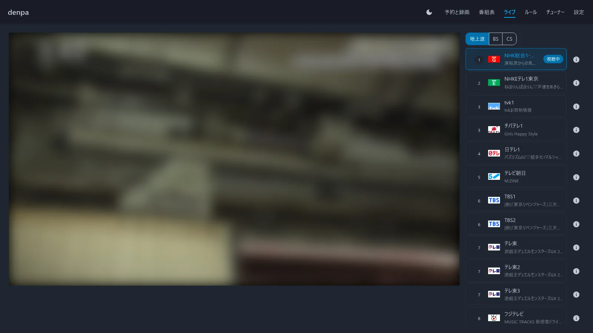

# denpa

**チューナーを挿して起動すれば、そのまま使える自宅用のテレビ録画サーバ**です。
設定ファイルは書かず、チューナーは種別 (地上波 / 衛星) まで自動で見分け、あとは画面でスキャンを押すだけ。
Mirakurun や EDCB、メディアサーバは要りません。番組表から予約し、CM は自動で飛ばし、
ライブも録画もブラウザで字幕・データ放送つきで観られます。テレビは専用のアプリ
[denpa-tv](https://github.com/danything/denpa-tv) で。

<p align="center">
  
</p>

<table>
  <tr>
    <td align="center"><a href="docs/screens.md#予約と録画"></a><br><sub><b>予約と録画</b> — サムネ付き。押せばその場で観る</sub></td>
    <td align="center"><a href="docs/screens.md#ライブ"></a><br><sub><b>ライブ</b> — 字幕もデータ放送も。止めれば追っかけ</sub></td>
    <td align="center"><a href="docs/screens.md#録画を観る"></a><br><sub><b>観る</b> — 放送どおりの字幕、CMは自動で飛ばす</sub></td>
  </tr>
</table>

ほかの画面 (番組表・ルール・チューナー・設定) は [docs/screens.md](docs/screens.md)。

## できること

- **予約** — 番組表から押すか、「ルール」のキーワードで自動で。同じ回は最初の放送だけ録る
- **録画** — CM を見つけてチャプターにし、AV1 / H.264 の mkv に焼く。字幕は放送の ARIB 字幕のまま入れる。Intel の GPU があれば使う
- **ライブ** — 放送から 1 秒ほどで。止めれば追っかけ、二カ国語・解説放送も選べる ([docs/stream.md](docs/stream.md))
- **データ放送** — テレビと同じ BML がブラウザで動く (d ボタン)。ライブでも録画でも
- **観る** — 行を押せばその場で再生。CM は1コマも見せずに飛ばし、続きから・倍速 (×1〜×2)・切り抜き (字幕ごと PNG)
- **字幕と放送の字** — 字幕は放送どおりの位置に描き、番組名・局名も含めて Denpa Font で外字まで崩さない
- **端末に落として観る** — 電波の無いところでも ([docs/offline.md](docs/offline.md))
- **EPGStation から引き継ぐ** — ルール・予約・録画 ([docs/migrate.md](docs/migrate.md))

部品はチャンネルを掴んで素の TS を流す **チューナーエージェント** と、それ以外の全部 (番組表・予約・録画・
エンコード・配信) をやる **denpa** の2つだけです ([docs/architecture.md](docs/architecture.md))。

## 立てる

### 1. 要るもの

- **チューナー** — 挿してあれば自動で見つけ、種別 (地上波 / 衛星) も見分けます

  | チューナー | 口 | ホストに入れるもの |
  | --- | --- | --- |
  | PT2 / PT3、PX-BCUD、PX-S1UD など | Linux DVB | ドライバ |
  | PX-Q3U4 / PX-W3U4 / PX-MLT 系など (px4-userland の対応機種) | px4-userland (同梱) | なし |
  | PX-S1UD (smsusb を blacklist したとき。Windows も) | siano-userland (同梱) | なし |
  | PX-W3U3 | asicen-userland (**試験的**。上流のリリース待ちで、まだ入らない) | なし |

- **B-CASカード** と PC/SC のカードリーダー (px4-userland の機材は内蔵リーダーでもよい)
- **OS** — Linux (amd64 / arm64)、Mac (Apple Silicon)、Windows (x64)
- **Docker** (Linux・Mac。Compose 込み) か、Windows は WSL (`wsl --update` で入る `wslc`。Docker Desktop は要らない)。
  Kubernetes なら Helm
- あれば Intel の GPU (`/dev/dri` を渡す。[docs/install.md](docs/install.md#用意するもの))。無ければソフトウェアで焼きます

### 2. 入れる

**1行で、denpa 本体とチューナーのエージェントの両方が立ち上がり、ブラウザが開きます。** clone は要りません。

```sh
# Linux / Mac
curl -fsSL https://raw.githubusercontent.com/danything/denpa/main/install.sh | bash
```

```powershell
# Windows (PowerShell)
irm https://raw.githubusercontent.com/danything/denpa/main/install.ps1 | iex
```

エージェントの置き場は OS で違います (どれも上の1行がやる)。

- **Linux** — エージェントも本体も Docker Compose のコンテナ (`~/denpa/compose.yml`)
- **Mac** — エージェントは Mac の上で直接 (LaunchAgent)、本体は Docker。USB をコンテナに渡せないため
- **Windows** — エージェントは Windows の上で直接 (タスク スケジューラ)、本体は `wslc` のコンテナ。
  チューナーは siano-userland の機材だけで、ドライバを WinUSB にしておく

Linux で Compose を手で置くなら、これだけです (エージェントは `tuner-agent` として一緒に立つ)。

```sh
mkdir denpa && cd denpa
curl -Lo compose.yml https://raw.githubusercontent.com/danything/denpa/main/compose.prod.yml
docker compose up -d
```

もう一度流すと最新のリリースに上がります。変えたい設定は `~/denpa/compose.override.yml`
(Windows は `~/denpa/denpa.env`) に書きます。

### 3. 開く

- <http://denpa.localhost> (Linux・Mac で [genkan](https://github.com/danything/genkan) を入れられたとき) か
  <http://localhost:3000>。LAN のほかの機器 (テレビ・スマホ) からは `http://<IP>:3000`
- **誰を通すか** — 設定するまで全部断ります。compose の `TRUSTED_NETWORKS` の初期値は家の中 (私設網) で、
  ここからはログインなしで通ります。画面をログインで守るなら OIDC の3つを渡します
  (リダイレクト URI は `https://<denpa>/login/callback`)

  ```yaml
  # ~/denpa/compose.override.yml
  services:
      denpa:
          environment:
              TRUSTED_NETWORKS: 192.168.1.0/24
              OIDC_ISSUER: https://login.microsoftonline.com/<tenant>/v2.0
              OIDC_CLIENT_ID: <アプリケーションID>
              OIDC_CLIENT_SECRET: <クライアントシークレット>
  ```

  **`TRUSTED_NETWORKS=0.0.0.0/0` はインターネットに向けて開くのと同じです。** 家の外に出すなら OIDC を使います
- 「チューナー」の画面で、見つかったチューナーを確かめて**スキャン**を押します。衛星は最初から局が入っていて、
  地上波は十数分。終わると番組表を集めるので (数分)、あとは番組表から予約するだけです
- **カードリーダーが NG のまま録ると、中身はスクランブルされたままです** (同じ画面に出ます)

1コンテナ (`denpa-aio`)・Helm・リバースプロキシの後ろに置くとき・困ったときは [docs/install.md](docs/install.md)、
ログインの細かいことは [docs/auth.md](docs/auth.md)。

## 観る

- **ブラウザ** — ホーム画面にも置ける ([docs/player.md](docs/player.md))
- **テレビ** (Android TV / Fire TV) — [denpa-tv](https://github.com/danything/denpa-tv)。テレビに出る QR をスマホで読めば繋がる
- **再生リンク** — ログインできない端末向けに、24時間有効の URL を渡す ([docs/library.md](docs/library.md#テレビのアプリと再生リンク))
- **外から使う口** — 局・録画の一覧、ライブ、音声だけ (Home Assistant やスクリプト向け。[docs/api.md](docs/api.md))

## もっと詳しく

- [docs/install.md](docs/install.md) — **立てる** (入れ方の選択肢・1コンテナ・Helm・前段の後ろに置く)
- [docs/screens.md](docs/screens.md) — 画面 (実機の絵)
- [docs/architecture.md](docs/architecture.md) — **なぜこの形なのか** (決めたこと・踏んだ落とし穴)
- [docs/app.md](docs/app.md) — **どこに何があるか** (ファイル・環境変数・画面・状態遷移)
- [docs/data.md](docs/data.md) — エージェントに都度聞くもの / denpa が持つもの
- [docs/agent.md](docs/agent.md) — チューナーを掴むところ (エージェント・取り合い・B-CAS・Mac / Windows)
- [docs/encode.md](docs/encode.md) — CM とエンコード (字幕・AV1・CM検出)
- [docs/logo.md](docs/logo.md) — 局ロゴ (番組表の PNG と CM検出用に覚えたロゴ)
- [docs/library.md](docs/library.md) — 録画の置き場と配り方 (テレビのアプリ・再生リンク・削除・通知)
- [docs/stream.md](docs/stream.md) — **ライブ視聴**
- [docs/player.md](docs/player.md) — ホーム画面に置く、LAN でも https で開く
- [docs/offline.md](docs/offline.md) — 端末に落として電波の無いところで観る
- [docs/auth.md](docs/auth.md) — **誰を通すか** (OIDC・信頼したネットワーク・ペアリング・期限付きのリンク)
- [docs/api.md](docs/api.md) — **外から使う口**
- [docs/migrate.md](docs/migrate.md) — **EPGStation からの引き継ぎ**
- [docs/development.md](docs/development.md) — **手を入れるとき** (開発環境・テスト)
- [docs/licenses.md](docs/licenses.md) — 借りているもの

手元の機材で試せていないもの (px4-userland・siano-userland の実機など) は各文書に書いてあります。
動いた/動かなかったを [Issue](https://github.com/danything/denpa/issues) で教えてもらえると助かります。

## 謝辞

**手を入れてくれた人** (ありがとうございます):

- [@Khronos31](https://github.com/Khronos31) — px4-userland / siano-userland で選局できなかったのを、PX-Q3U4 の実機で見つけて直してくれました (#188)。ほかにも不具合を報告してくれました (#195 #376 #377)
- [@unlimish](https://github.com/unlimish) — ライブ・追っかけ・観る画面に小窓 (PiP) を足してくれました (#431)。非力な機材で複数のライブを観るときの詰まりを実測つきで報告してくれ、ライブを GPU で焼く道ができました (#417)

**土台にしている仕事**:

- [px4-userland](https://github.com/Khronos31/px4-userland) / [siano-userland](https://github.com/Khronos31/siano-userland) (@Khronos31) — ホストにドライバを入れずにチューナーを使えるのはこれのおかげです。PX-MLT5PE / DTV02A-5TS-P の対応は @siketyan
- [web-bml](https://github.com/otya128/web-bml) (otya128) — データ放送を描く

## ライセンス

**AGPL-3.0-or-later** ([LICENSE](LICENSE))。ネットワーク越しに使わせる形で配るなら、その中身も同じ条件で
渡せるようにしてほしい、という理由で選んでいます。借りているもの (ffmpeg・Denpa Font・web-bml ほか) は
元のライセンスのままで、一覧は [docs/licenses.md](docs/licenses.md)。
