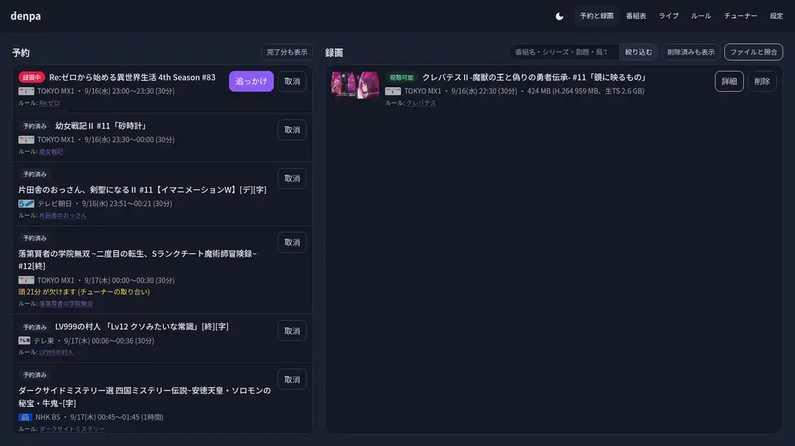
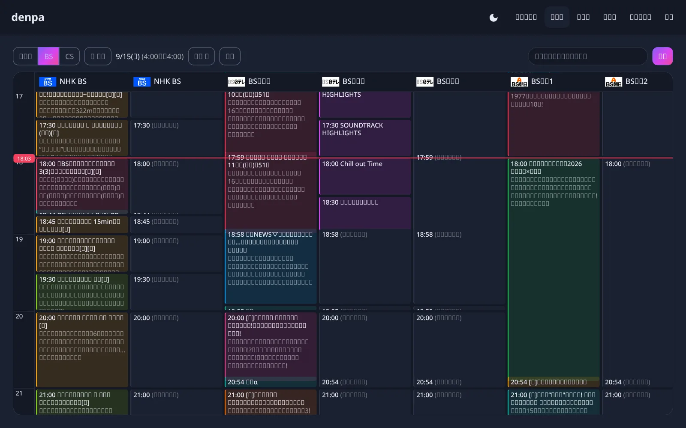
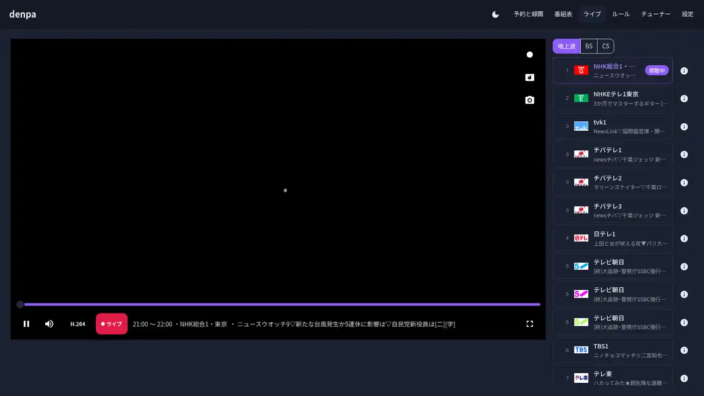
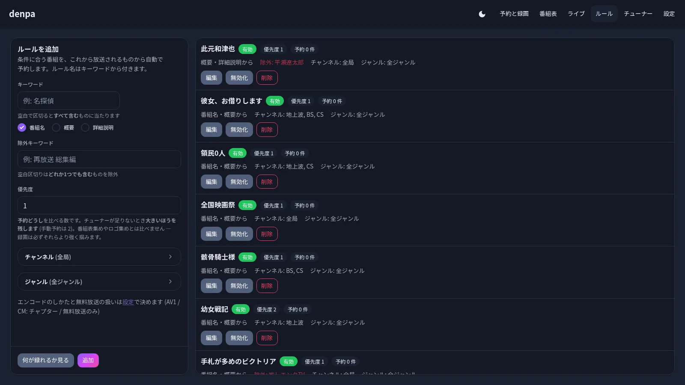
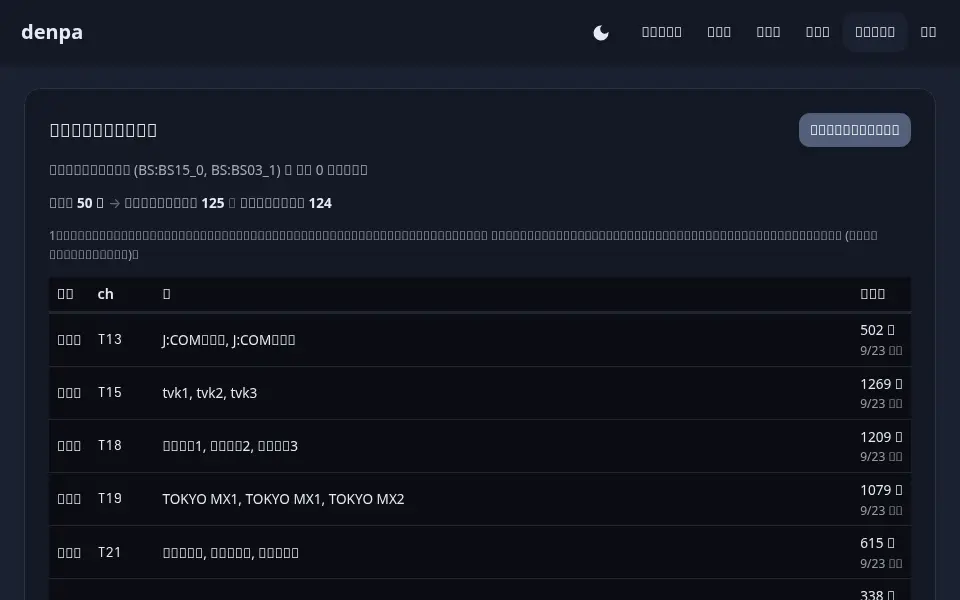
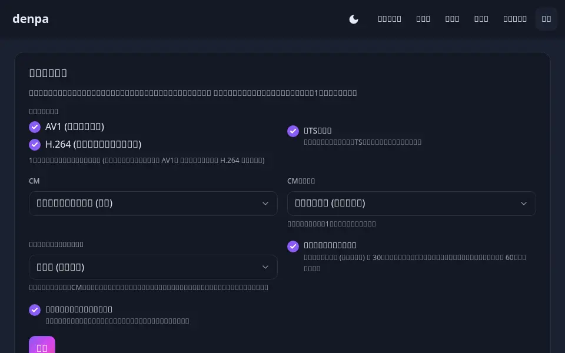

# 画面

実機の絵です (映像はぼかしてあります)。

| 探しもの | 見る場所 |
| --- | --- |
| 立て方 | [README](../README.md#立てる) |
| なぜこの形か | [architecture.md](architecture.md) |

## 予約と録画

左が予約、右が録画。録画の行はサムネイル付きで、押せばその場で観る画面へ (まだ焼けていないものは追っかけ再生へ)
([library.md](library.md#観るのはブラウザで))。

録画の行を押すと、そのまま観る画面へ (映像はぼかしてあります):

「詳細」で番組の中身と操作。**テレビで再生** (テレビの VLC へ飛ばす)、**端末に保存**
(オフライン視聴)、「その他…」に再生リンクのコピー・ダウンロード・焼き直し。
コマ数 (30/60) や字幕の有無もここに出ます。

## 番組表

局ごとの縦の帯。**いま**の線が引かれ、押せば詳細から予約。上の欄で全チャンネルの
番組名から検索できます。

BS/CS はロゴがカルーセルから拾われて出ます ([logo.ts](../src/lib/server/logo.ts))。

## ライブ

放送中のものをそのままブラウザで。**映像・音声・字幕・データ放送**が入っていて、
局は右の一覧から切り替え。止めれば追っかけ再生になります ([stream.md](stream.md))。

## 録画を観る

焼いたものをブラウザで。字幕は放送どおりの絵で重ね、CMはチャプターで飛ばせます。
右は番組の中身、下の帯に再生・字幕・切り抜き・速さ。

## ルール

キーワード・ジャンル・局で自動予約。書きながら右に「いま何が引っかかるか」が出ます。

## チューナー

取れているチャンネルと番組表の集まり具合、チャンネルスキャン、チューナーの設定、
チューナーの空きとカードリーダー、ロゴ。**うまくいかないときはまずここ**。1枚に収まらないので
上から下へ巻いています。

## 設定

録画のしかた (コーデック・CMの扱い・コマ数・生TSを残すか)、GPU、通知先、テレビ (VLC) の
一覧、データ放送の郵便番号、EPGStation からの引き継ぎ。上から下へ巻いています。
**自分の値の入る欄はぼかしてあります。**

