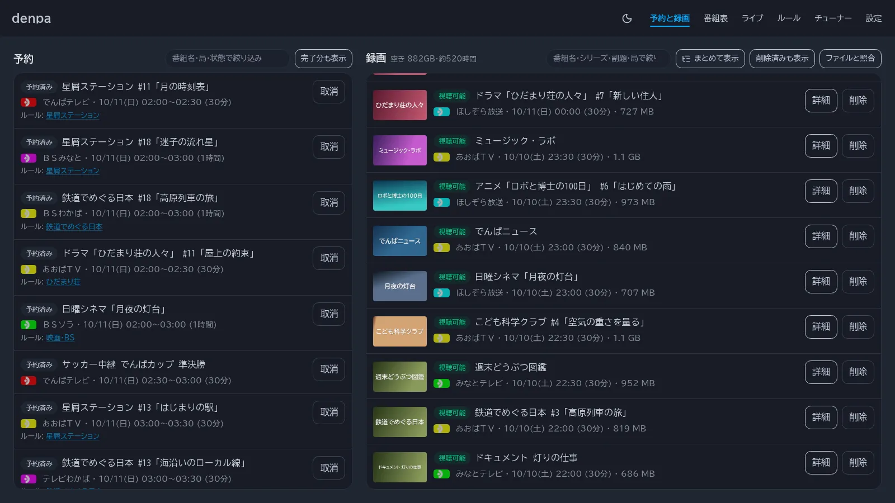
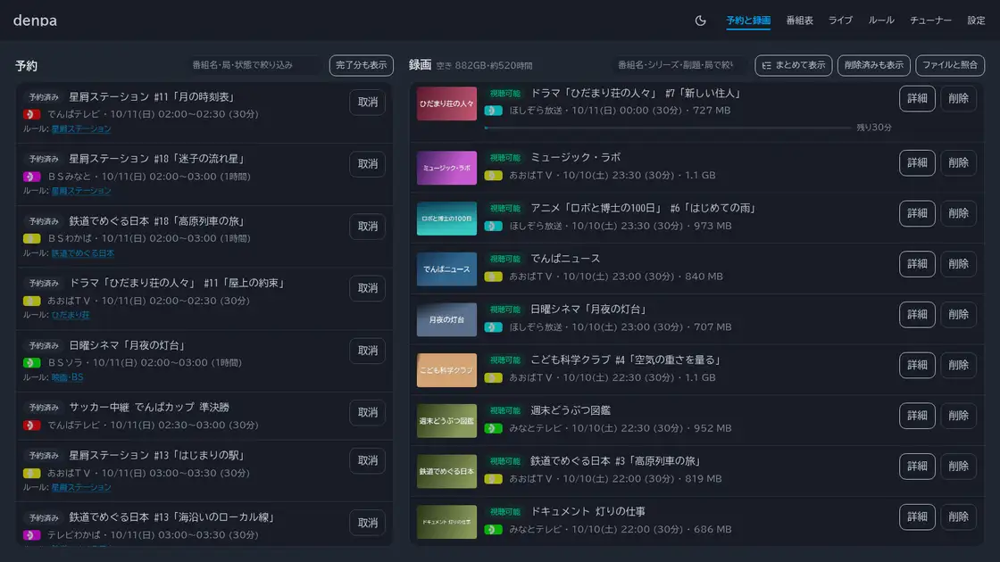
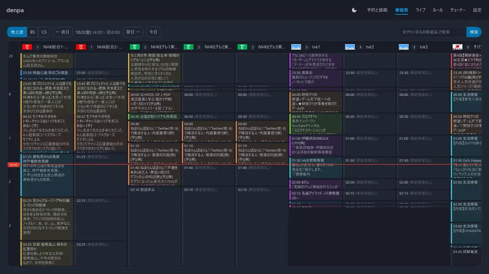
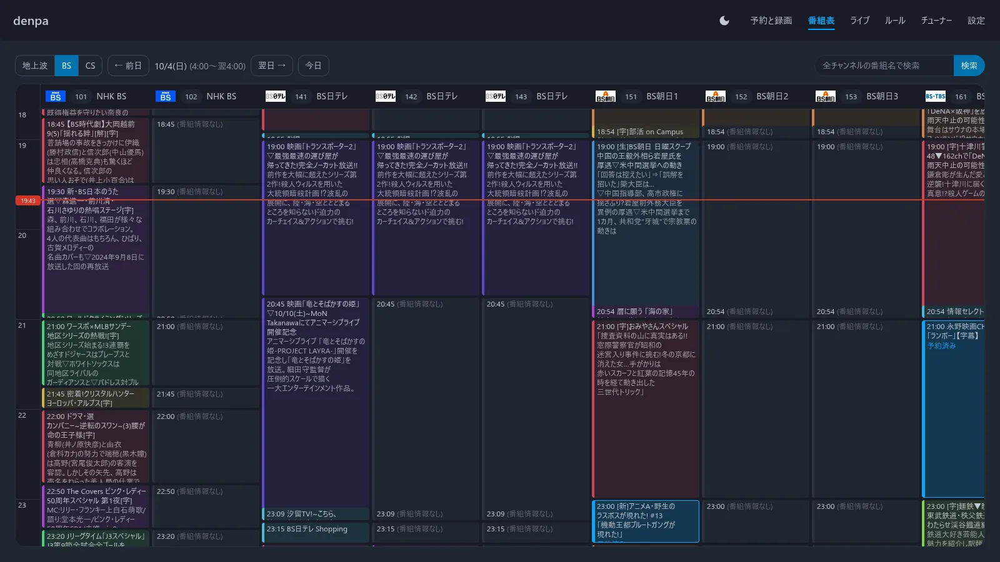
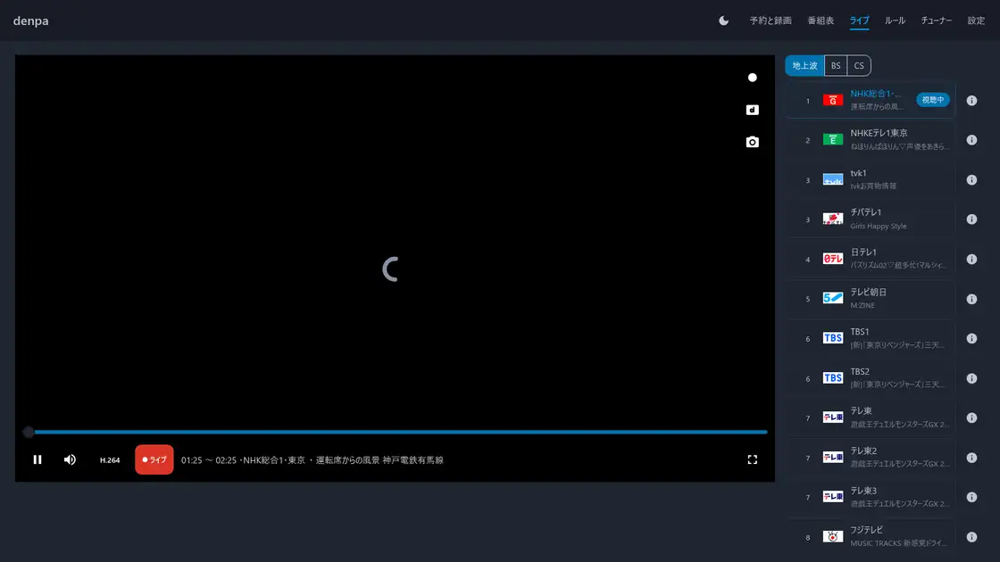
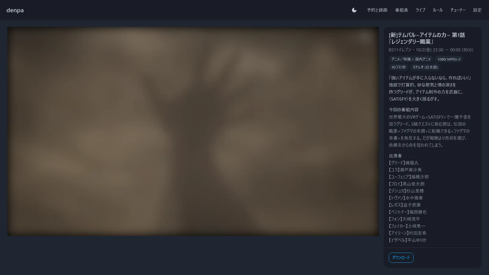
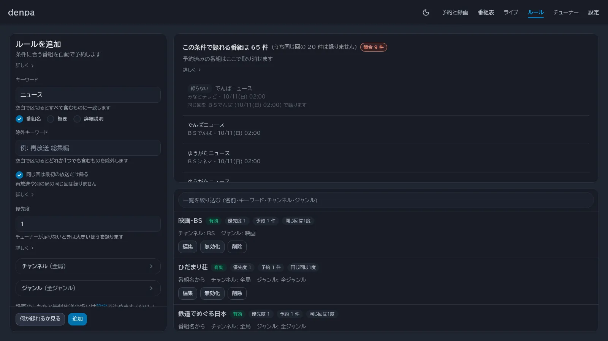
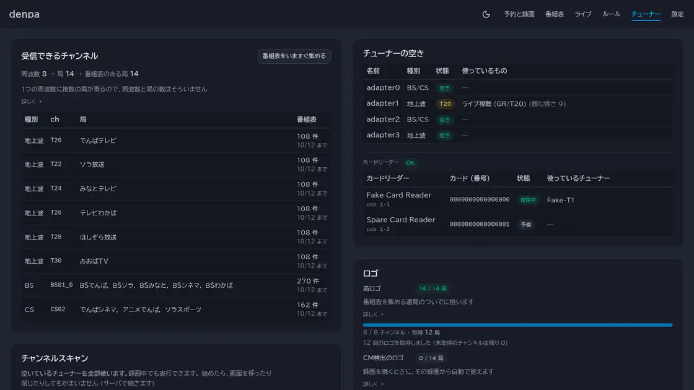
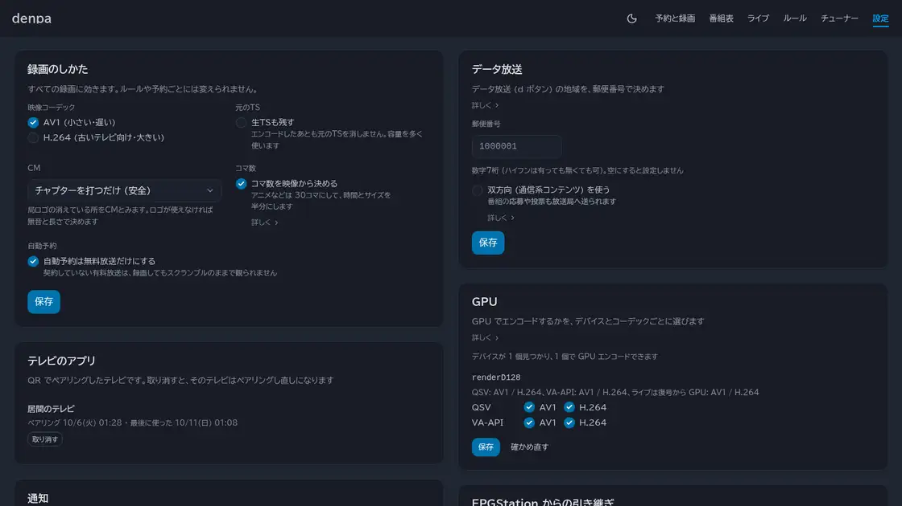

# 画面

偽の放送 (作り物の局・番組・映像) で撮った絵です。撮り直し方は [development.md](development.md#readme-の絵)。

立て方は [install.md](install.md)。

## 予約と録画

左が予約、右が録画。録画の行はサムネイル付きで、押せばその場で観る画面へ
(まだ焼けていないものは追っかけ再生へ。[library.md](library.md#観るのはブラウザで))。

録画の行を押すと、そのまま観る画面へ:

録画が溜まってきたら、録画の見出しの「まとめて表示」で**番組ごと**にまとめられます
(端末ごとに覚えます。入っている間はボタンが主の色で塗られます)。まとめる単位は、焼いたものを置くシリーズのフォルダと同じです。
番組は最新の回が新しい順に並び、見出しを押すと第1話から放送順に開きます。
1本しか無い番組はまとめずにふつうの行のまま出ます。絞り込みはそのまま効き、
絞っている間は当たった番組を開いて出します。まとめているときは一覧の一番上
(最近録れた番組) から開きます。開いた番組の頭と、録画の詳細の「その他…」には
「この番組のルールを作る」があり、シリーズ名を入れたルールの下書きを持ってルール画面へ行きます
(既にその番組を録っているルールがあれば、作らずにそちらを案内します)。

「詳細」で番組の中身と操作。「端末に保存」
(オフライン視聴)、「その他…」に再生リンクのコピー・ダウンロード・焼き直し・CM検出のやり直し。
コマ数 (30/60) や字幕の有無もここに出ます。

## 番組表

局ごとの縦の帯。マスの左の線がジャンルの色で、予約済み・録画中は線の色が変わります。
いまの線が引かれ、押せば詳細が開いてそこから予約・取消。上の欄で全チャンネルの
番組名から検索できます。

BS/CS はロゴがカルーセルから拾われて出ます ([logo.ts](../src/lib/server/logo.ts))。

## ライブ

放送中のものをそのままブラウザで。映像・音声・字幕・データ放送が入っていて、
局は右の一覧から切り替え。止めれば追っかけ再生になります ([stream.md](stream.md))。

## 録画を観る

焼いたものをブラウザで。字幕は放送どおりの位置に重ね、CMは自動で飛ばします (1コマも見せません)。
右は番組の中身、下の帯に再生・字幕・速さ、右の列に閉じる・d・切り抜き・削除。

## ルール

キーワード・ジャンル・局で自動予約。書きながら右に「いま何が引っかかるか」が出ます。

「同じ回は最初の放送だけ録る」(新しく作るルールは入った状態で始まります) を入れておくと、
`[新]` のようなゆるい条件で拾っても、局を替えた再放送や同時放送は録りません。
同じ時刻に流れているなら字幕のあるもの、次に BS/CS を選びます。録らないものも一覧に
「録らない」として、どの放送で録るのかと一緒に出ます。

## チューナー

取れているチャンネルと番組表の集まり具合、チャンネルスキャン、チューナーの設定、
チューナーの空きとカードリーダー、ロゴ。**うまくいかないときはまずここ**。上から下へ巻いています。

## 設定

使う頻度の順に、録画のしかた (コーデック・生TSを残すか・CMの扱い・コマ数)、テレビのアプリ (繋いだ端末)、通知先、データ放送の郵便番号、GPU、EPGStation からの引き継ぎ、画面の高さを見る。説明は要点1行で、
続きは「詳しく」に畳んであります。上から下へ巻いています。

